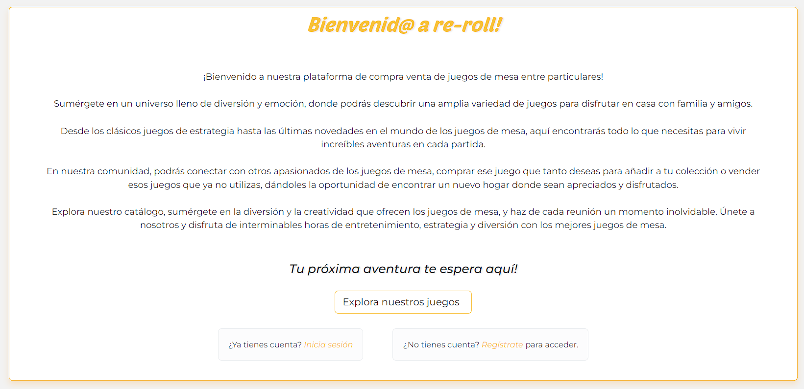
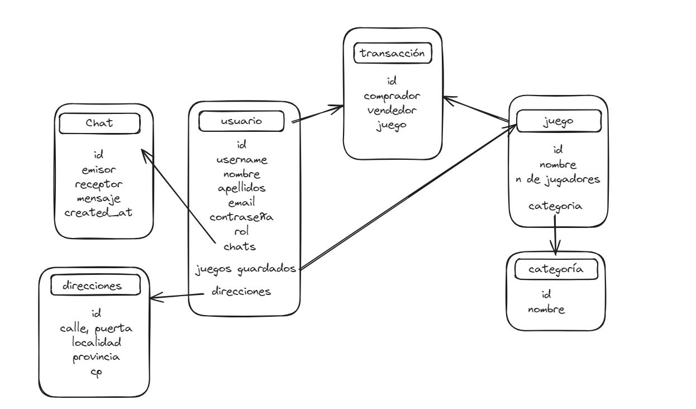

# Proyecto final - Compra-venta de juegos entre particulares



<details>
  <summary>Contenido 📝</summary>
  <ol>
    <li><a href="#sobre-el-proyecto">Sobre el proyecto</a></li>
    <li><a href="#objetivo">Objetivo</a></li>
    <li><a href="#instalación-en-local">Instalación</a></li>
    <li><a href="#endpoints">Endpoints</a></li>
    <li><a href="#stack">Stack</a></li>
    <li><a href="#creación-del-proyecto">Creación del proyecto</a></li>
    <li><a href="#contacto">Contacto</a></li>

  </ol>
</details>

## Sobre el proyecto

Los usuarios podrán registrarse en la aplicación, iniciar sesión y acceder a su área personal. Los usuarios podrán crear anuncios para poner a la venta juegos de mesa. También podrán navegar por los distintos juegos que hay a la venta en la plataforma y comprarlos. Cada vez que se sube un nuevo anuncio, el usuario recibe un correo electrónico con los detalles del mismo. Así mismo, cuando se realiza una compra-venta el vendedor recibe un correo electrónico con los datos del juego que ha vendido y los datos de dirección del comprador, para que pueda proceder al envío del producto.

Los usuarios tendrán una libreta de direcciones, desde la cual se pueden crear nuevas direcciones, así como modificar y eliminar las existentes.

El backend de esta web-app está desplegado en [Enlace a Zeabur](https://reroll-back.zeabur.app/hello)

## Objetivo

Este proyecto requería la creación de una API funcional en Node JS mediante la cual los usuarios pudieran realizar todas las gestiones necesarias para la compra-venta de juegos de segunda mano entre particulares.



## Instalación en local

1. Clonar el repositorio
2. Instalamos las dependencias `$ npm install`
3. Creamos una conexión con MongoAtlas
4. Conectamos nuestro repositorio en Mongo Compass con la base de datos de MongoAtlas
5. Ejecutamos los seeders `$ npm run seeder`
6. Ponemos en funcionamiento el servidor `$ npm run dev`

## Endpoints

<details>
  <summary>Zona para profesores ℹ️</summary>
  <ol>
    <li>Usuario admin: 

   ```
rerollgamesales@gmail.com.com
password: administrador
```
</li>
    <li>Usuario de prueba
      
   ```
alex@gmail.com
password: 123456789
```
  </li>
   <li>
   A tener en cuenta: el envío de emails se realiza a direcciones reales, por lo que para poder comprobarlo se recomienda crear un anuncio con un usuario con un email del que seas propietario, así como realizar una compra a un usuario que hayamos creado con un email del que seas propietario y eliminar un anuncio de un usuario del que seas propietario.
  </ol>
</details>

<details>
<summary>Endpoints</summary>

- AUTH

  - REGISTRO

            POST https://reroll-back.zeabur.app/api/auth/register

    body:

    ```js
        {
            "username": "example",
            "email": "example@gmail.com",
            "password": "princess"
        }
    ```

    Registro de usuario

  - LOGIN

          POST https://reroll-back.zeabur.app/api/auth/login

    body:

    ```js
        {
            "email": "example@gmail.com",
            "password": "princess"
        }
    ```

    Login de usuario

- USER

  - VER TODOS LOS USUARIOS

            GET https://reroll-back.zeabur.app/api/user

    El usuario tiene que ser admin para ver todos los usuarios

  - VER USUARIO

        GET https://reroll-back.zeabur.app/api/user/:username

    Se puede ver el perfil de un usuario concreto excluyendo datos sensibles como el email

  - ACTUALIZAR USUARIO

        PUT https://reroll-back.zeabur.app/api/user/:username

    body FORM-DATA:

        key: avatar type: file value: "example.jpg"

        key: description type: text value: "example text"

    El usuario podrá modificar su propio perfil, cambiando su descripción y la imagen de su avatar.

  - BORRAR USUARIO

        DELETE https://reroll-back.zeabur.app/api/user/:id

    El usuario deberá ser admin para poder borrar un usuario específico.


- GAME

  - VER TODOS LOS JUEGOS

        GET https://reroll-back.zeabur.app/api/game

    Vista de todos los juegos anunciados en la plataforma.

  - VISTA DETALLADA DE JUEGO

        GET https://reroll-back.zeabur.app/api/game/:id

    Vista detallada de un único juego anunciado en la plataforma.

  - CREAR JUEGO

        POST https://reroll-back.zeabur.app/api/game

    body FORM-DATA:

        key: name type: text value: "exampleName"

        key: description type: text value: "example description"

        key: playersMin type: text value: 2

        key: playersMax type: text value: 4

        key: category type: text value: "EL ID DE LA CATEGORÍA"

        key: price type: text value: 50

        key: image1 type: file value: "example1.jpg"

        key: image2 type: file value: "example2.jpg"

        key: image3 type: file value: "example3.jpg"

    Creación de un nuevo anuncio, el usuario deberá estar logado. Al terminar la operación recibirá un email confirmándole los datos de su anuncio.

  - ACTUALIZAR JUEGO

        PUT https://reroll-back.zeabur.app/api/game/:id

    body FORM-DATA:

        key: name type: text value: "exampleName"

        key: description type: text value: "example description"

        key: playersMin type: text value: 2

        key: playersMax type: text value: 4

        key: category type: text value: "EL ID DE LA CATEGORÍA"

        key: price type: text value: 50

        key: image1 type: file value: "example1.jpg"

        key: image2 type: file value: "example2.jpg"

        key: image3 type: file value: "example3.jpg"

    Edición de un anuncio existente. Sólo puede realizarlo el usuario propietario del anuncio.

  - BORRAR JUEGO

        DELETE https://reroll-back.zeabur.app/api/game/:id

    body:

    ```js
        {
            "reason": "el juego infringe nuestra política de anuncios"
        }
    ```

    Sólo usuario admin. Se borra un juego, indicándole el motivo por el que se ha borrado. Se le envía e-mail al anunciante con el motivo de la eliminación.


  - RESERVAR JUEGO

        PUT https://reroll-back.zeabur.app/api/game/reserve/:id

    Sólo puede ser realizado por el propietario del anuncio. Se marca un juego como Reservado, para informar a otros usuarios intenten comprarlo. Es bidireccional, se llama al mismo endpoint para eliminar la reserva.

  - VENDER JUEGO

        PUT https://reroll-back.zeabur.app/api/game/sell/:id

    Sólo puede ser realizado por el propietario del anuncio. Se marca un juego como Vendido, para evitar que otros usuarios intenten comprarlo. Es bidireccional, se llama al mismo endpoint para eliminar la venta.

- ADDRESS

  - VER DIRECCIONES DE USUARIO

            GET https://reroll-back.zeabur.app/api/address

    body:

    ```js
        {
        "name": "ExampleName",
        "lastName": "ExampleLastName",
        "streetAddress": "ExampleAddress",
        "city": "ExampleCity",
        "province": "ExampleProvince",
        "cp": 28080
        }
    ```

    Vista de todas las direcciones del usuario que está logado.

  - VISTA DETALLADA DE UNA DIRECCIÓN

        GET https://reroll-back.zeabur.app/api/address/:id

    Vista detallada de una única dirección del usuario que está logado.

  - CREAR DIRECCIÓN

        POST https://reroll-back.zeabur.app/api/address

    body:

    ```js
        {
        "name": "ExampleName",
        "lastName": "ExampleLastName",
        "streetAddress": "ExampleAddress",
        "city": "ExampleCity",
        "province": "ExampleProvince",
        "cp": 28080
        }
    ```

    Creación de una dirección del usuario que está logado.

  - ACTUALIZAR DIRECCIÓN

        PUT https://reroll-back.zeabur.app/api/address/:id

    body:

    ```js
        {
        "name": "ExampleName",
        "lastName": "ExampleLastName",
        "streetAddress": "ExampleAddress",
        "city": "ExampleCity",
        "province": "ExampleProvince",
        "cp": 28080
        }
    ```

    Actualización de una dirección del usuario que está logado.


  - BORRAR DIRECCIÓN

        DELETE https://reroll-back.zeabur.app/api/address/:id

    Solo usuario propietario de la dirección. Se borra la dirección seleccionada.

- CATEGORY

  - VER TODAS LAS CATEGORÍAS

        GET https://reroll-back.zeabur.app/api/category

    Vista de todas las categorías creadas en la plataforma para los distintos juegos.

  - CREAR CATEGORÍA

        POST https://reroll-back.zeabur.app/api/category

    body:

    ```js
        {
        "name": "ExampleCategory"
        }
    ```

    Sólo usuario admin. Creación de nuevas categorías.


- TRANSACTION

        POST https://reroll-back.zeabur.app/api/transaction

  body:

  ```js
      {
          "game": "6635f1ff346492f8f55f9ec8",
          "address": "663faaa2026010c641a10865"
      }
  ```

  Se le pasa el id del juego y de la dirección del comprador. El id del comprador se recoge del token, y el id del vendedor se recoge de la BBDD al buscar por el juego. Al realizar una transacción, se envía un correo electrónico al vendedor informándole de los datos (nombre y dirección) del usuario que ha realizado la compra.

    </details>

## Stack

Tecnologías utilizadas:

<div align="center">
<a href="https://www.mongodb.com/es">

</a>
<a href="https://www.expressjs.com/">
    
</a>
<a href="https://nodejs.org/en/">
    
</a>
<a href="https://www.typescriptlang.org/">
    
</a>
<a href="https://typeorm.io/">
    
</a>

Librerías externas:

    Mailjet

<div align="center">
<a href="https://www.mailjet.com/es/"> 

 </div>
 </a>
</div>

    Cloudinary

<div align="center">
<a href="https://cloudinary.com/"> 

 </div>
 </a>
</div>

## Creación del proyecto

### Pasos para la Instalación y Configuración

#### Para configurar un proyecto de Express con TypeScript, sigue estos pasos:

- Crea una carpeta para tu proyecto.

- Inicializa el archivo package.json con

` npm init`

- Instala Express con

`npm install express --save`

- Instala TypeScript como dependencia de desarrollo con

`npm install typescript -D`

- Instala los tipos de Express y Node con

`npm install @types/express @types/node -D`

- Configura el archivo tsconfig.json con

` npx tsc --init`

- Instalar librería de nodemon

` npm install --save-dev nodemon`

## Script de compilación

En el apartado de scripts de package.json:

    "dev": "nodemon ./src/server.ts"

## Contacto

<a href = "mailto:aipachecogarcia@gmail.com
"></a>
<a href="https://www.linkedin.com/in/anapachecogarcia/" target="_blank"></a>

</p>
